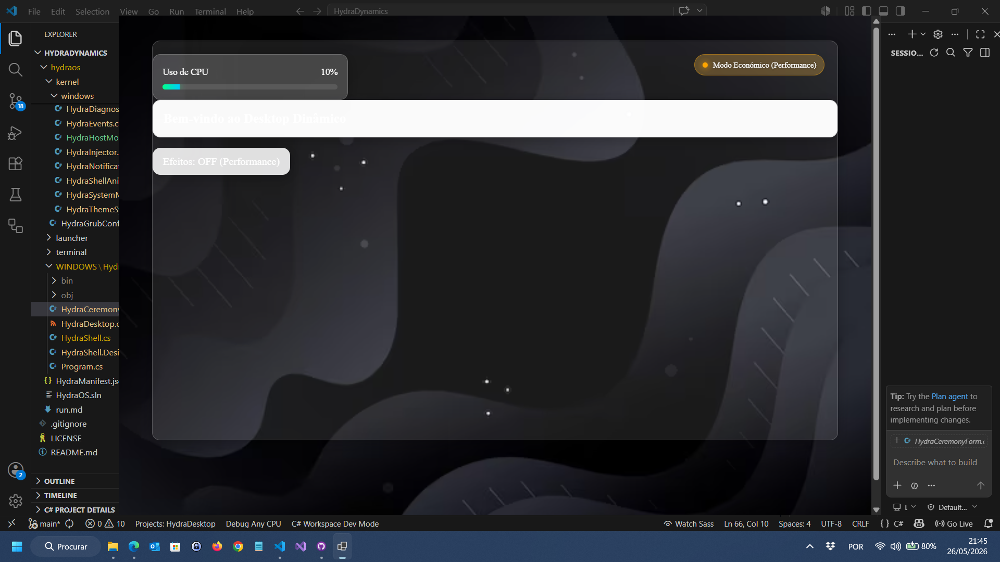
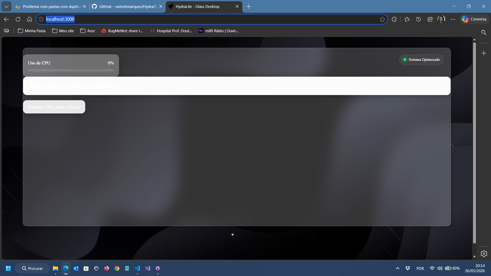
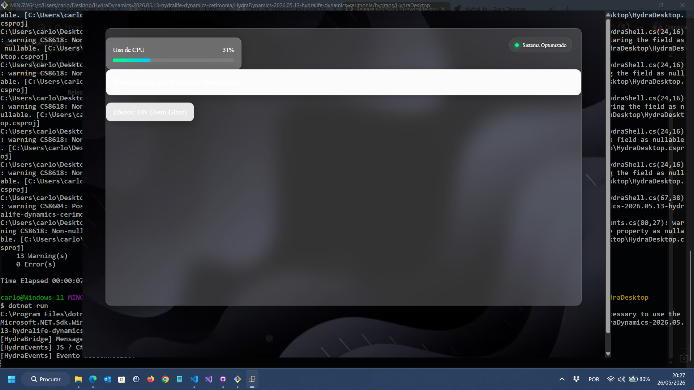
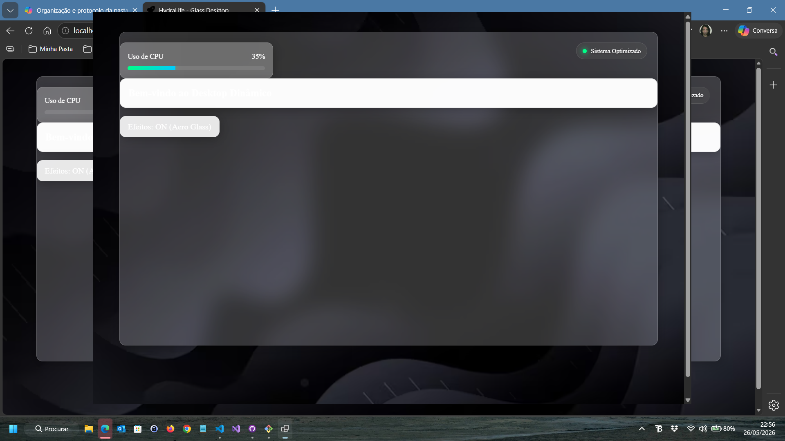

<!-- markdownlint-disable MD032 MD033-->
<!-- Write your README.md file. Build something amazing! This README.md template can guide you to build your project documentation, but feel free to modify it as you wish 🥰 -->
# 🔥 **hydraprojects-cyber/**
<div align="center">
  <a href="https://github.com/hydraprojects-cyber/">
    
  </a>

  <div style="margin-top:10px;">
    <a href="https://github.com/hydraprojects-cyber">
      
    </a>
    <a href="https://github.com/hydraprojects-cyber">
      
    </a>
    <a href="https://github.com/hydraprojects-cyber/HydraOS">
      
    </a>
    <a href="https://github.com/hydraprojects-cyber/HydraOS/pulls">
      
    </a>
  </div>
</div>


---

## 🤔 **About the project**

# 🐍 HydraOS — Solid‑State Hybrid Operating System

HydraOS is the ceremonial hybrid operating system that powers the entire Hydra ecosystem.  
It provides the stable foundation for HydraTerminal, HydraDesktop, HydraDynamics and all internal modules.

---
## ✨ Features

- Solid‑State architecture (no daemons, no background chaos)
- Deterministic boot pipeline (Analyzer → Launcher → BIOS → GRUB → Desktop)
- Modular kernel with adaptive shell
- Cross‑platform Windows/GNU support
- Ritual‑based configuration system
- Real‑time logs and transparent execution
- Immersive integration with the host machine without resource overload, optimizing application payload and host shell performance
- Conky‑based shell with glassmorphism interface and WebView modal popup forms for a fullscreen virtual OS environment
- Desktop bounds managed through C# properties for precise window control and adaptive layout

---

## 🔄 Update System

HydraOS uses a solid‑state update mechanism inspired by Linux package managers.  
The system checks for new releases published in this repository and applies updates without recompiling anything.

### 🧠 Update Pipeline (Linux‑style)


Código
HydraOS → check version
        → fetch latest release JSON
        → compare version
        → download ZIP
        → extract
        → overwrite system files
        → keep user configs
        → restart
Isto é literalmente:

Código
apt update
apt upgrade
Mas para HydraOS.

---

## 📦 Project Structure

```text
HydraOS/
├─ assets/          # UI, themes, icons, conky configs, webview assets
├─ docs/            # Documentation, specs, architecture, roadmap
├─ screenshots/     # Project images for README
├─ scripts/         # Ritual scripts, build helpers, automation
├─ System/          # Kernel, shell, boot pipeline, modules
├─ CHANGELOG.md     # Version history
├─ LICENSE          # License file
└─ README.md        # Project documentation

```

## ⚡ **Installation**

* <!-- ... [SHOW HOW YOUR PROJECT IS INSTALLED] -->

---

## 🚀 **Usage**

* <!-- ... [SHOW HOW YOUR PROJECT IS USED] -->

---

## 🌲 **Project tree**

<!-- ... [SHOW YOUR PROJECT TREE HERE IF USEFUL] -->

---

## 📝 **Additional notes**

* <!-- ... [ADD ADDITIONAL NOTES] -->
---

## 📸 Screenshots

A collection of screenshots showcasing the HydraOS environment, UI, rituals, and system modules.

<table>
  <tr>
    <td align="center">
      
    </td>
    <td align="center">
      
    </td>
  </tr>
  <tr>
    <td align="center">
      
    </td>
    <td align="center">
      
    </td>
  </tr>
</table>

---
## 🍰 **Supporters and donors**

<a href="https://github.com/hydraprojects-cyber/">
  
</a>

We are currently looking for new donors to support and maintain this project! ❤️

By donating, you will help the development of this project, and *you will be featured in this README.md*, so everyone can see your kindness and visit your content ⭐.

<a href="https://github.com/sponsors/hydraprojects-cyber">
  
</a>

---

This project was generated from *[Josee9988/project-template](https://github.com/Josee9988/project-template)* 📚

---

## 🕵️ Extra recommendations

* <!-- Add any special recommendations or usage notes here -->

---

## 🎉 Was the OS helpful? Help us raise these numbers up

[](https://github.com/hydraprojects-cyber)
[](https://github.com/hydraprojects-cyber/HydraOS/stargazers)
[](https://github.com/hydraprojects-cyber/HydraOS/watchers)
[](https://github.com/hydraprojects-cyber/HydraOS/network/members)
[](https://github.com/sponsors/hydraprojects-cyber)


Enjoy! 😃

---

## ⚖️📝 **License and Changelog**

See the license in the '**[LICENSE](LICENSE)**' file.

Watch the changes in the '**[CHANGELOG.md](CHANGELOG.md)**' file.
---

**Made with a lot of ❤️ by [@carloshmarques](https://github.com/carloshmarques)**  
HydraOS is maintained by *[hydraprojects-cyber](https://github.com/hydraprojects-cyber)* 🐍🔥
